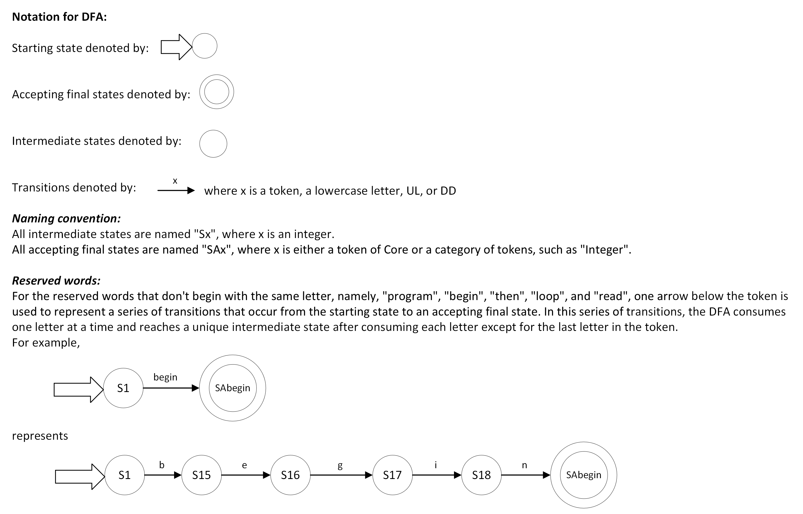
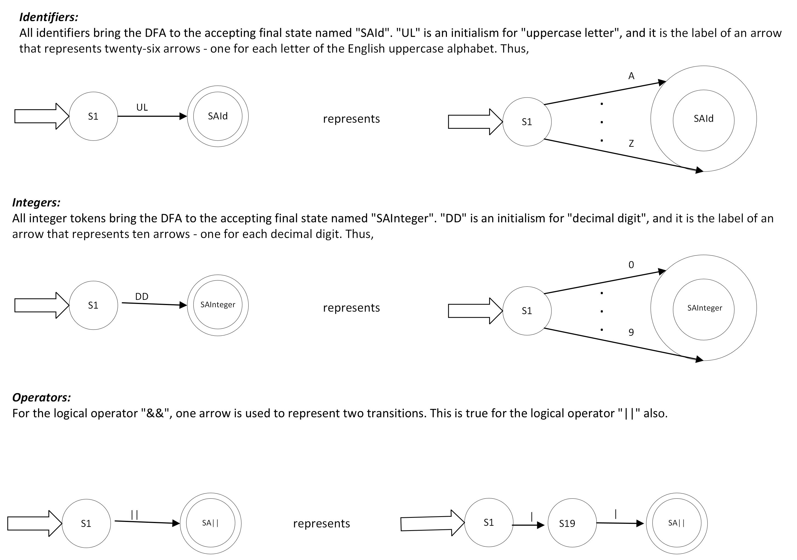
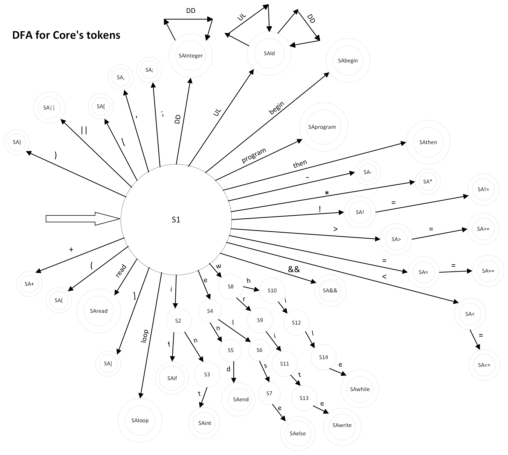

# Core Interpreter

## Description

This repository contains an interpreter for the Core programming language - a
simple, imperative, dynamically typed language created for the course CSE 5341
"Principles of Programming Languages." The Core interpreter is written in
Python, and it therefore runs on the Python interpreter.

## BNF Grammar for Core

\<prog> ::= program \<decl seq> begin \<stmt seq> end  
\<decl seq> ::= \<decl> | \<decl> \<decl seq>  
\<stmt seq> ::= \<stmt> | \<stmt> \<stmt seq>  
\<decl> ::= int \<id list>;  
\<id list> ::= \<id> | \<id>, \<id list>  
\<stmt> ::= \<assign> | \<if> | \<loop> | \<in> | \<out>  
\<assign> ::= \<id> = \<exp>;  
\<if> ::= if \<cond> then \<stmt seq> end;  
&nbsp;&nbsp;&nbsp;&nbsp;&nbsp;&nbsp;&nbsp;&nbsp;&nbsp;&nbsp;&nbsp;
| if \<cond> then \<stmt seq> else \<stmt seq> end;  
\<loop> ::= while \<cond> loop \<stmt seq> end;  
\<in> ::= read \<id list>;  
\<out> ::= write \<id list>;  
\<cond> ::= \<comp> | !\<cond> | [\<cond> && \<cond>] | [\<cond> || \<cond>]  

## Deterministic Finite Automaton (DFA)

