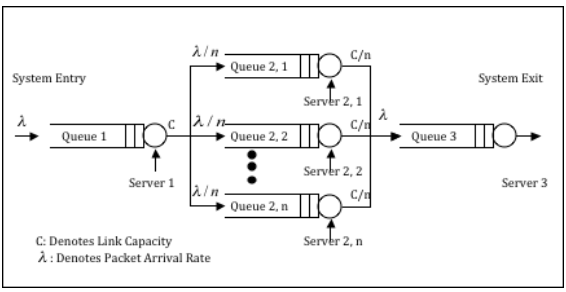

# Open Queuing Network Analysis

## Description

This is a top-level directory containing a [module](network_statistics.py) for
an open queuing network that uses Kleinrock's Independence Approximation to
adopt an M/M/1 model at each node. The module's only class models the network
around parameters that are passed to the class instantiation operator. The class
contains methods for computing steady-state statistics from queuing theory and
from simulated packet transmissions for various arrival rates, service rates,
and number of parallel intermediate nodes in the network. The class also uses
[Matplotlib](https://matplotlib.org) to create comparative and quantitative
plots of steady-state statistics versus arrival rate.

This was an assignment for the course CSE 6101 "Computer Communication Networks."

## Queuing Model

